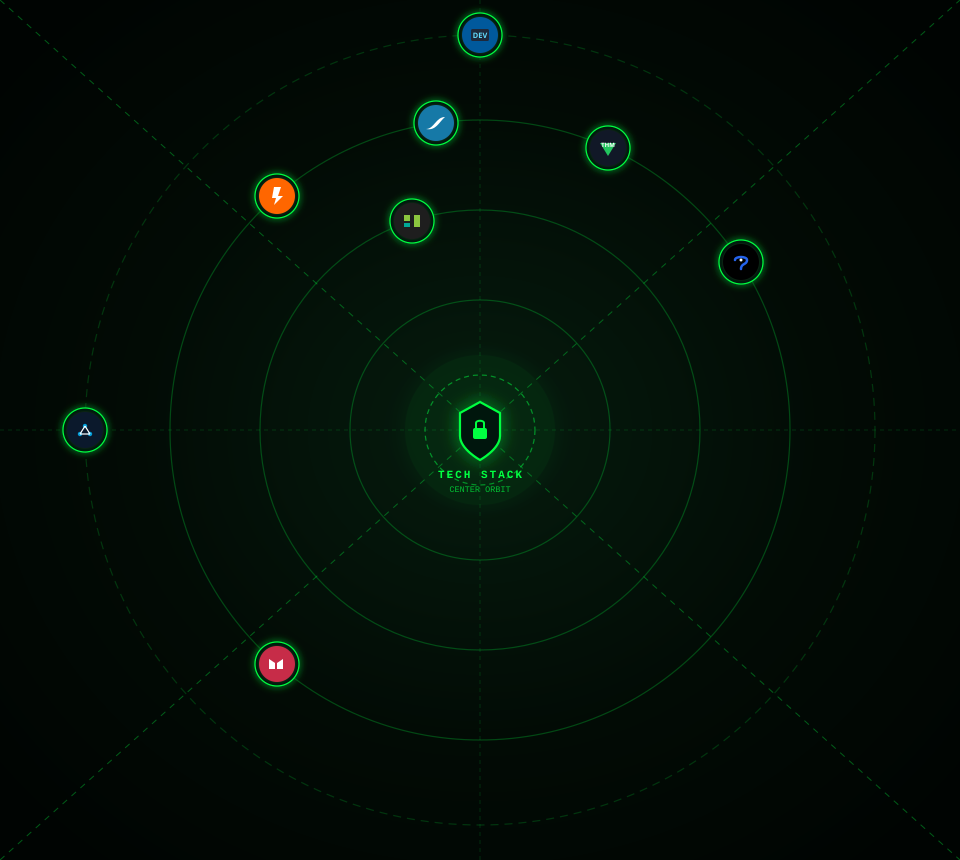

<h1>👋 Hi, I'm trandh1602</h1>

<h3>🛡️ Information Security Student</h3>

  

  

---

## 🧑‍💻 About Me

🎓 **Major:** Information Security

🔐 **Focus:** Cyber Security · Network Security · Web Security

🌐 **Interests:** Computer Networks · Network Administration · Security Engineering

🐧 **Currently Learning:** Linux · Networking · Cyber Security · Web Security

💻 **Background:** Software Development · Backend Development · Database Systems

🧩 **Learning Through:** Hands-on Labs · CTFs · Networking Simulations · Personal Projects

🎯 **Goal:** Build strong practical skills in cybersecurity while developing solid software and networking foundations.

---

## 🛡️ Areas of Interest

**Cyber Security** · **Network Security** · **Web Security**

**Computer Networks** · **Linux** · **Security Engineering**

**CTF** · **Packet Analysis** · **System Administration**

---

## 🧰 Tech Stack

---

## 🌐 Networking

`TCP/IP` · `IPv4` · `Subnetting` · `VLSM`

`RIPv2` · `OSPF` · `EIGRP`

`PPP` · `PAP` · `CHAP`

---

## 📚 Currently Learning

🛡️ **Cyber Security** · 🌐 **Network Security** · 🔐 **Web Security**

🐧 **Linux** · 🔎 **Packet Analysis** · 🧪 **CTF**

⚙️ **Backend Development** · ☁️ **Infrastructure & DevOps**

---

## 🎯 Career Direction

**Information Security**

↓

**Cyber Security · Network Security · Web Security**

↓

**Security Engineering**

---

<h3>🛡️ Learn · Build · Secure</h3>

⭐ Thanks for visiting my profile!

